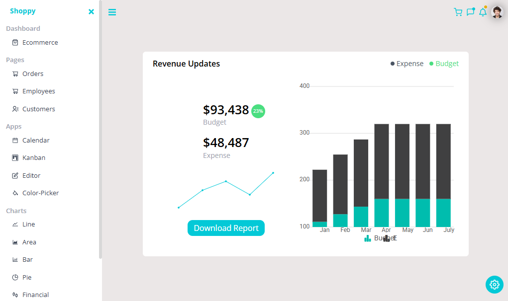

    <a href="https://euphonious-cupcake-3d6ab7.netlify.app/">
    
    <a>

&nbsp;&nbsp;&nbsp;
  &nbsp;&nbsp;&nbsp;
   

---

### Shoppy - Comprehensive E-commerce Analytics Dashboard
Shoppy is a powerful, intuitive dashboard designed to provide real-time insights and comprehensive analytics for e-commerce businesses. Monitor your revenue, track expenses, and optimize your budget with our all-in-one business intelligence platform.

---

### <a name="tech-stack">⚙️ Tech Stack</a>

- React.js
- TypeScript
- Tailwind CSS